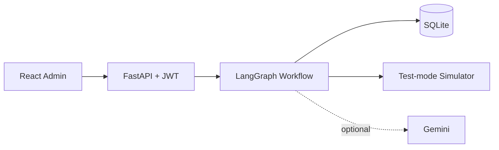
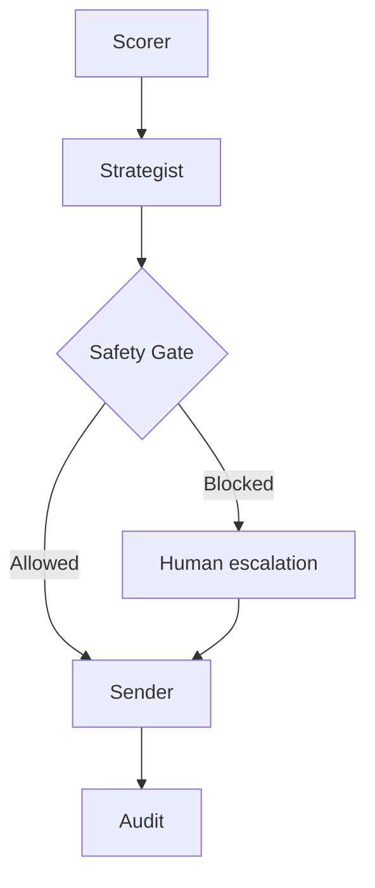

# RecoverAI — AI Revenue Recovery Agent

> **Synthetic test data — no real transactions. All payment actions use a deterministic simulator/test-mode adapter.**

RecoverAI is a runnable MVP for **Razorpay AI Builder Internship 2026 — Track 03: AI Revenue Recovery**. It receives failed recurring-payment cases, scores recoverability, selects one recovery action, enforces strict safety rules, simulates the approved action, measures explicitly recovered revenue, and stores a complete audit trail.

## Problem and Razorpay relevance

Recurring-payment failures create involuntary churn and manual operational work. A payment platform can help merchants recover legitimate revenue while protecting customers from unsafe retries. RecoverAI demonstrates that balance: autonomous processing is bounded by retry limits, opt-out enforcement, idempotency, confidence thresholds, and human approval for high-value cases.

## Features

- LangGraph flow: Scorer → Strategist → Safety Gate → Sender → Audit
- Gemini strategy enhancement when `GEMINI_API_KEY` exists; deterministic fallback otherwise
- Razorpay-labelled test-mode simulator that never charges real money
- SQLite persistence, seeded with 120 reproducible synthetic cases
- JWT admin login with hashed password verification
- Batch and individual processing, approval/rejection queue, audit viewer, CSV export
- Responsive React dashboard with stored-data metrics and Recharts visualizations
- Docker Compose, structured logging, validation, graceful errors, and Pytest coverage

## Architecture





More detail: [docs/ARCHITECTURE.md](docs/ARCHITECTURE.md).

## Agents

| Agent | Responsibility |
|---|---|
| Scorer | Produces a 0–100 priority and expected recoverable value from amount, failure reason, attempts, and history. |
| Strategist | Selects exactly one of RETRY, REMIND, ESCALATE, STOP with confidence and a concise reason. |
| Safety Gate | Applies retry, expiry, opt-out, confidence, high-value, and idempotency controls. |
| Sender | Uses deterministic SHA-256-derived outcomes in a clearly labelled test-mode simulator. REMIND never directly records revenue. |
| Audit | Persists each decision and explanation without secrets or full payment credentials. |

## Safety controls

- At most three retries; expired cards are never retried.
- Amounts above ₹25,000 require an admin decision.
- Confidence below 0.70 escalates.
- Opted-out customers cannot be contacted or retried.
- Unique idempotency keys reject duplicate ingestion; repeated case processing also returns HTTP 409.
- No card details, API secrets, or production transaction data are accepted or displayed.
- A REMIND action records ₹0 recovered. Only a later, explicitly processed successful payment could record recovery.

## Quick start (local)

Requirements: Python 3.11+ and Node.js 20+.

```bash
cp .env.example .env
python -m venv .venv
source .venv/bin/activate        # Windows: .venv\Scripts\activate
pip install -r backend/requirements.txt
python -m backend.app.seed
uvicorn backend.app.main:app --reload --port 8000
```

In another terminal:

```bash
cd frontend
npm install
npm run dev
```

Open `http://localhost:5173`; API docs are at `http://localhost:8000/docs`.

## Docker

```bash
cp .env.example .env
docker compose up --build
```

Open `http://localhost:5173`. Stop with `docker compose down` (the SQLite file remains in `data/`).

## Demo credentials

- Email: `admin@recoverai.demo`
- Password: `RecoverAI@2026`

These are intentionally visible demo credentials. Change both values in production-like environments.

## Environment variables

| Variable | Purpose | Default/example |
|---|---|---|
| `DATABASE_URL` | SQLAlchemy database URL | `sqlite:///./data/recoverai.db` |
| `JWT_SECRET` | Token signing secret | Change before deployment |
| `ADMIN_USERNAME` | Demo admin login | `admin@recoverai.demo` |
| `ADMIN_PASSWORD` | Demo admin password | `RecoverAI@2026` |
| `CORS_ORIGINS` | Comma-separated allowed origins | `http://localhost:5173` |
| `GEMINI_API_KEY` | Optional Gemini strategy enhancement | Empty = rules only |
| `RAZORPAY_MODE` | Must remain simulator/test mode | `simulator` |
| `VITE_API_URL` | Browser-visible backend URL | `http://localhost:8000` |

## API

| Method | Endpoint | Purpose |
|---|---|---|
| POST | `/api/auth/login` | Obtain JWT |
| GET | `/api/metrics` | Calculated recovery and safety metrics |
| GET/POST | `/api/cases` | Paginated/filterable list; ingest a test event |
| GET | `/api/cases/{case_id}` | Case detail |
| POST | `/api/cases/{case_id}/process` | Run one workflow |
| POST | `/api/cases/process-all` | Run all pending workflows |
| POST | `/api/cases/{case_id}/approve` | Approve an escalated case |
| POST | `/api/cases/{case_id}/reject` | Stop an escalated case |
| GET | `/api/cases/{case_id}/audit` | Case decision history |
| GET | `/api/audit` | Paginated audit feed |
| GET | `/api/reports/csv` | Synthetic report export |
| GET | `/api/health` | Public liveness endpoint |

Except health and login, endpoints require `Authorization: Bearer <token>`.

## Testing

```bash
source .venv/bin/activate
pytest -q
cd frontend && npm run build
```

Tests cover priority scoring, every strategy, retry limit, expired-card blocking, low confidence, high-value approval, opt-out, duplicate ingestion, batch processing, and health.

## Measured demo results

No production claims are made. Run the fixed seed and click **Process All Pending Cases**; the dashboard calculates results from the persisted simulator output. The exact values are reproducible for a given code version and seed. The CSV labels every row as synthetic.

## Known limitations

- Simulator only; no production Razorpay payment capture or webhooks.
- Single demo admin and synchronous batch processing.
- SQLite is intended for local demonstration, not horizontal scale.
- Gemini output is constrained and rechecked by deterministic safety rules but is not evaluated as a production model.
- Reminder attribution is deliberately not implemented, so reminders cannot inflate recovered revenue.

## Future improvements

Production integrations could add Razorpay signed webhooks/test APIs, PostgreSQL, Redis/Celery workers, MFA and user RBAC, WebSocket updates, Slack/email alerts, RAG-based policy retrieval, and PDF reports. These are intentionally outside this MVP.

## Five-minute pitch video

1. **0:00–0:35** — Failed recurring payments and RecoverAI's value.
2. **0:35–1:05** — FastAPI/React/SQLite and LangGraph architecture.
3. **1:05–2:00** — Process a safe technical-error retry and open its audit trail.
4. **2:00–2:35** — Show expired-card or retry-limit blocking.
5. **2:35–3:10** — Approve/reject a high-value escalation.
6. **3:10–3:35** — Submit the same idempotency key twice; show HTTP 409/audit evidence.
7. **3:35–4:30** — Process all, explain metrics, charts, and CSV.
8. **4:30–5:00** — Measured synthetic results, limitations, and next steps.

Full presenter notes: [docs/DEMO_SCRIPT.md](docs/DEMO_SCRIPT.md).

## Screenshots

| Screen | Placeholder |
|---|---|
| Login | `docs/screenshots/login.png` |
| Dashboard | `docs/screenshots/dashboard.png` |
| Case audit drawer | `docs/screenshots/case-audit.png` |
| Human review | `docs/screenshots/human-review.png` |

## Disclaimer

This independent internship project is not an official Razorpay product. **Synthetic test data — no real transactions.**

