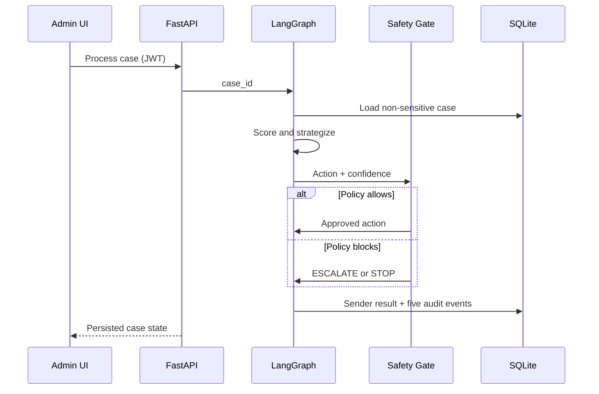

# RecoverAI Architecture

## Components

The React/Vite SPA authenticates once and sends a bearer JWT to FastAPI. FastAPI validates input with Pydantic v2 and persists SQLAlchemy models in SQLite. A synchronous LangGraph state machine invokes five bounded agents. The Sender is a deterministic simulator: SHA-256 of the idempotency key produces a stable bucket, compared with a reason-specific success threshold.

## Decision sequence

## Data and trust boundaries

- The browser never receives the JWT secret or Gemini key.
- The API accepts references, reason, amount, attempts, history score, and opt-out only—never PAN, CVV, bank credentials, or full customer identity.
- Gemini, when enabled, can recommend but cannot bypass deterministic safety rules.
- `idempotency_key` is unique at database level; duplicate ingestion returns HTTP 409 and increments a stored counter.
- A high-value approval reruns the safety gate with an explicit in-memory approval flag and writes a new trace.

## Status transitions

`pending → processing → recovered | failed | reminded | escalated | stopped`. An escalated case can be approved and rerun or rejected into `stopped`.

## Metric definitions

| Metric | Stored-data calculation |
|---|---|
| Revenue at risk | Sum of all case amounts |
| Revenue recovered | Sum of `recovered_amount` |
| Success rate | Recovered cases / recovered + failed cases |
| Strategy rate | Recovered / cases grouped by final strategy |
| Average recovery time | Mean `recovered_at - recovery_started_at` |
| Escalation rate | Currently escalated / all cases |
| Unsafe blocked | Sum of safety-block counters |
| Duplicates prevented | Sum of duplicate counters |
| Unresolved exceptions | Failed cases |
| False/inappropriate retries | Stored violations; expected zero because gate prevents them |

